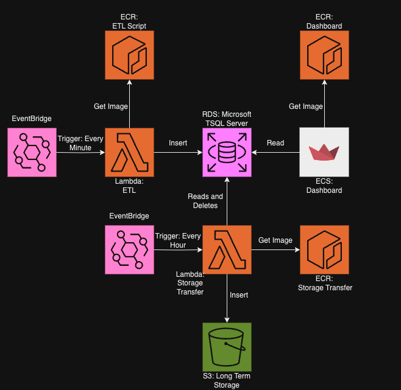

# c10-lmnh-plants-project


## Requirements


To install requirements, if you want to run the scripts manually, run this command line in the root of the directory within a virtual environment:
```sh
pip3 install -r requirements.txt
```
The following are all the requirements for all the scripts to run within the project:
```sh
pandas
python-dotenv
pymssql
pytest
pylint
pytest-mock
requests-mock
aiohttp
boto3
```

## Cloud Architecture and Project Structure



## Directories

### etl-script


The directory requires a .env file to run which is not on github because of security reasons. There is a Dockerfile to create an image of the etl pipeline for use in a cloud container and to have one working version.

The ETL script is contained here. The ETL pipeline is split into 3 scripts:
```sh
extract.py
transform.py
load.py
```

The ETL script has the ability to send emails upon Sensor Faults using the email_alert.py script linked to the transform.py.

All scripts have corresponding unit test scripts which can be run using pytest. 


### long-term-storage

The directory requires a .env file to run which is not on github because of security reasons. There is a Dockerfile to create an image of the storage loading script pipeline for use in a cloud container and to have one working version.

The short term to long term storage script is contained here:
```sh
storage_load.py
```

All scripts have corresponding unit test scripts which can be run using pytest. 


### schema

This directory contains the necessary tools to create, populate and delete the RDS Database. It uses Microsoft TSQL as the form of sql and has a python script to automatically fill the metadata into the database. The files are:
```sh
reset.sh
schema.sql
insert_metadata.py
```

#### ERD


### terraform

This directory contains the necessary terraform files to build up the cloud services and tear them down again. They cover creating the Lambda functions, the event schedulers and the S3 bucket. All these elements are also linked where necessary. 

A file for secret variables needs to be created this file needs to end in .tfvars and needs to contain:
```sh
ACCESS_KEY_ID
SECRET_ACCESS_KEY
BUCKET_NAME
DB_USER
DB_PASS
SCHEMA_NAME
DB_HOST
DB_PORT
DB_NAME
```

To build the cloud services, run these commands:
```sh
terraform init
terraform plan
terraform apply
```
To tear down the cloud services, use:
```sh
terraform destroy
```

## Useful scripts

### activate_venv.sh

Easily build and enter a venv with
```sh
bash activate_venv.sh
```

### connect_to_db.sh

The following env variables must be accessible to the script:
```sh
DB_HOST
DB_NAME
DB_USER
DB_PASS
DB_PORT
```

Then easily connect to the database with
```sh
bash connect_to_db.sh
```

